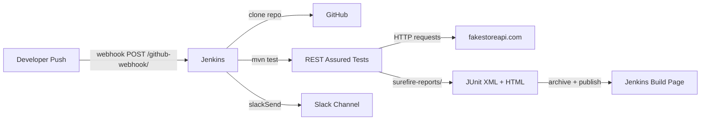
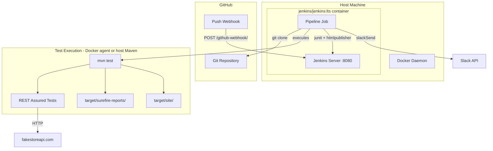
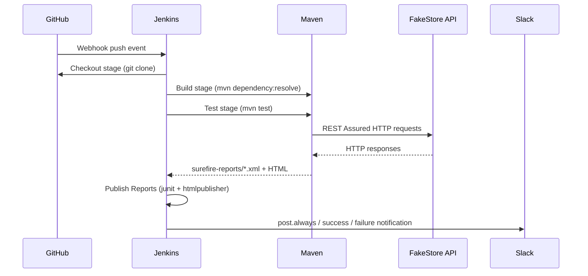

# Design Document: Jenkins CI/CD API Testing

## Overview

This design describes the end-to-end CI/CD pipeline for automated REST API testing against the public FakeStore API (https://fakestoreapi.com/). The system consists of four integrated layers:

1. A Maven/Java test suite using REST Assured + TestNG that validates FakeStore API endpoints
2. A Dockerfile that packages the test suite into a reproducible execution environment
3. A Jenkins instance (running via Docker) that orchestrates the pipeline
4. A declarative Jenkinsfile that defines the pipeline stages, report publishing, and Slack notifications

The pipeline is triggered automatically by GitHub webhook on every push, runs all tests, publishes JUnit XML and HTML reports to Jenkins, and sends Slack notifications on build completion.



---

## Architecture

### Component Interaction



### Pipeline Stage Flow



---

## Components and Interfaces

### 1. Test Suite Structure

The test suite lives under `src/test/java/org/example/api/` and is organized by FakeStore resource group:

```
src/test/java/org/example/api/
├── ProductsApiTest.java      # /products endpoints
├── CartsApiTest.java         # /carts endpoints
├── UsersApiTest.java         # /users endpoints
├── AuthApiTest.java          # /auth/login endpoint
└── BaseApiTest.java          # shared RestAssured config, base URI, timeouts
```

`BaseApiTest` sets the global REST Assured configuration:
- `RestAssured.baseURI = "https://fakestoreapi.com"`
- Default response time threshold (< 2000 ms)
- JSON content-type defaults

Each test class uses TestNG annotations (`@Test`, `@BeforeClass`) and asserts:
- HTTP status code via `.statusCode(expected)`
- Response body fields via `.body("field", matcher)`
- Response time via `.time(lessThan(threshold))`

### 2. Maven Project Configuration (`pom.xml`)

Key additions to the existing `pom.xml`:

| Dependency / Plugin | Version | Purpose |
|---|---|---|
| `io.rest-assured:rest-assured` | 5.4.0 | HTTP client + assertion DSL |
| `org.testng:testng` | 7.9.0 | Test runner |
| `maven-surefire-plugin` | 3.2.5 | Test execution + XML report generation |
| `maven-surefire-report-plugin` | 3.2.5 | HTML report generation (`mvn surefire-report:report`) |

The compiler source/target will be set to Java 17 (LTS, compatible with all declared dependencies).

Surefire is configured to:
- Include `**/*Test.java` patterns
- Output XML to `target/surefire-reports/`
- Set a test suite timeout of 120 seconds

### 3. Dockerfile

Located at the repository root. Uses a multi-stage-friendly single-stage build:

```
Base image: maven:3.9-eclipse-temurin-17
WORKDIR: /app
COPY: pom.xml + src/
RUN: mvn dependency:go-offline (layer cache)
CMD: ["mvn", "test"]
VOLUME: /app/target (for report extraction)
```

### 4. Jenkins Instance

Launched via `docker run` or `docker-compose.yml`:

```
Image: jenkins/jenkins:lts
Ports: 8080:8080, 50000:50000
Volumes: jenkins_home:/var/jenkins_home
```

Required plugins (installed via Jenkins Plugin Manager or `plugins.txt`):
- `git`
- `workflow-aggregator` (Pipeline)
- `htmlpublisher`
- `junit`
- `slack`

### 5. Jenkinsfile

Declarative pipeline at the repository root. Key structural elements:

```groovy
pipeline {
    agent any
    tools { maven 'Maven 3.9'; jdk 'JDK 17' }
    triggers { githubPush() }
    stages {
        stage('Checkout')                  { steps { checkout scm } }
        stage('Build & Install Deps')      { steps { sh 'mvn dependency:resolve -B' } }
        stage('Run Tests')                 { steps { sh 'mvn test -B' } }
        stage('Publish Reports')           { steps { junit, publishHTML } }
    }
    post {
        always   { /* archive reports */ }
        success  { slackSend(color: 'good', ...) }
        failure  { slackSend(color: 'danger', ...) }
    }
}
```

### 6. GitHub Webhook

Configured in GitHub repo Settings → Webhooks:
- Payload URL: `http://<jenkins-host>:8080/github-webhook/`
- Content type: `application/json`
- Events: `push`

Jenkins job must have "GitHub hook trigger for GITScm polling" enabled.

### 7. Slack Notification Interface

Uses the Jenkins Slack Notification plugin (`slackSend` step). Configuration:
- Jenkins global config: Slack workspace, credential (Bot Token), default channel
- `slackSend` parameters: `channel`, `color` (`good`/`danger`/`warning`), `message`
- Message includes: `${env.JOB_NAME}`, `${env.BUILD_NUMBER}`, `${env.BUILD_URL}`, build status

---

## Data Models

### Test Result (JUnit XML — Surefire output)

```xml
<testsuite name="org.example.api.ProductsApiTest" tests="5" failures="0" errors="0" time="3.2">
  <testcase name="getAllProducts_returns200" classname="org.example.api.ProductsApiTest" time="0.8"/>
  <testcase name="getProductById_validId_returnsProduct" classname="org.example.api.ProductsApiTest" time="0.6"/>
  <!-- ... -->
</testsuite>
```

Fields used by Jenkins JUnit plugin: `tests`, `failures`, `errors`, `time`, `testcase.name`, `testcase.classname`, `failure.message`.

### Slack Notification Payload

```
[SUCCESS|FAILURE] Job: <job_name> #<build_number>
Duration: <duration>
URL: <build_url>
```

### Jenkins Pipeline Environment Variables

| Variable | Source | Usage |
|---|---|---|
| `MAVEN_HOME` | Jenkins tool config | Maven binary path |
| `JAVA_HOME` | Jenkins tool config | JDK binary path |
| `SLACK_CHANNEL` | Jenkins env / Jenkinsfile | Target Slack channel |
| `BUILD_URL` | Jenkins built-in | Link in Slack message |
| `BUILD_NUMBER` | Jenkins built-in | Build identifier |
| `JOB_NAME` | Jenkins built-in | Job identifier |

### FakeStore API Resource Model (subset used in tests)

```
Product:  { id, title, price, description, category, image, rating: { rate, count } }
Cart:     { id, userId, date, products: [{ productId, quantity }] }
User:     { id, email, username, password, name, address, phone }
AuthToken:{ token }
```

---

## Correctness Properties

*A property is a characteristic or behavior that should hold true across all valid executions of a system — essentially, a formal statement about what the system should do. Properties serve as the bridge between human-readable specifications and machine-verifiable correctness guarantees.*

### Property 1: Test run produces both XML and HTML reports

*For any* execution of `mvn test` against the test suite, the `target/surefire-reports/` directory SHALL contain at least one `.xml` file and the `target/` directory SHALL contain at least one `.html` report file.

**Validates: Requirements 1.3, 1.4**

---

### Property 2: API error responses cause test failure with descriptive message

*For any* FakeStore API endpoint that returns an HTTP 4xx or 5xx status code in response to a structurally valid request, the corresponding REST Assured test SHALL fail and the failure message SHALL contain the actual status code received.

**Validates: Requirements 1.5**

---

### Property 3: Slack notification message contains all required fields

*For any* build outcome (success or failure), the Slack message produced by the Notifier SHALL contain the build status string, the job name, the build number, and the build URL as substrings of the message body.

**Validates: Requirements 9.1**

---

## Error Handling

### API Test Failures

- REST Assured assertions use `.statusCode()` and `.body()` matchers; a mismatch throws `AssertionError` which TestNG records as a test failure with the full expected-vs-actual diff.
- Response time assertions use `lessThan(2000L)` (milliseconds); exceeding the threshold fails the test with a timing message.
- Network errors (connection refused, timeout) propagate as `IOException` and are recorded as test errors (not failures) in the XML report.

### Maven Build Failures

- If `mvn test` exits non-zero, the Jenkins `sh` step throws an exception, marking the stage as failed.
- The `post { always { ... } }` block ensures report archiving still runs even when the test stage fails (Surefire writes partial XML before the build exits).

### Slack Notification Failures

- The `slackSend` call in `post.failure` and `post.success` is wrapped in a `catchError(buildResult: 'SUCCESS')` block so a Slack API outage does not change the build result.
- Jenkins logs the delivery failure at `WARNING` level for operator visibility.

### Jenkins Plugin Installation Failures

- Jenkins startup uses `--ignore-errors` semantics for plugin installation; a failed plugin is logged and skipped, allowing the server to start with the remaining plugins.

### Webhook Delivery Failures

- GitHub records each webhook delivery attempt with HTTP response code and body.
- Failed deliveries (non-2xx from Jenkins) can be manually re-delivered from the GitHub webhook settings page.
- Jenkins does not need to handle duplicate deliveries specially because the pipeline is idempotent per commit SHA.

---

## Testing Strategy

### Dual Testing Approach

Both unit/example tests and property-based tests are used. They are complementary:

- **Example tests** verify specific, concrete behaviors and structural requirements (file existence, Jenkinsfile syntax, pom.xml content).
- **Property-based tests** verify universal behaviors that must hold across all inputs (report generation, error response handling, notification content).

### Unit / Example Tests

These are standard TestNG tests that verify concrete behaviors:

| Test | What it checks | Requirement |
|---|---|---|
| `ProductsApiTest` | GET /products → 200, body has `id`/`title`/`price` | 1.1, 1.2 |
| `CartsApiTest` | GET /carts → 200, body has `id`/`userId` | 1.1, 1.2 |
| `UsersApiTest` | GET /users → 200, body has `id`/`email` | 1.1, 1.2 |
| `AuthApiTest` | POST /auth/login → 200, body has `token` | 1.1, 1.2 |
| `PomStructureTest` | pom.xml contains REST Assured, TestNG, Surefire deps | 2.1, 2.2 |
| `DockerfileStructureTest` | Dockerfile FROM uses JDK+Maven image, CMD is `mvn test` | 3.1, 3.3 |
| `JenkinsfileStructureTest` | Stages in correct order, post blocks present, slackSend present | 6.1, 7.1–7.6 |
| `RepoStructureTest` | README.md, Jenkinsfile, Dockerfile, .gitignore exist | 4.1–4.4 |

Edge cases covered by example tests:
- `GET /products/0` → 404 (invalid ID)
- `POST /auth/login` with wrong credentials → 401
- Empty response body handling

### Property-Based Tests

Uses **jqwik** (Java property-based testing library) with a minimum of **100 iterations** per property.

Each property test is tagged with a comment in the format:
`// Feature: jenkins-cicd-api-testing, Property <N>: <property_text>`

#### Property 1 Test: Report generation invariant

```java
// Feature: jenkins-cicd-api-testing, Property 1: Test run produces both XML and HTML reports
@Property(tries = 100)
void reportFilesExistAfterTestRun(@ForAll("validTestRunScenarios") TestRunScenario scenario) {
    // Given: a test run has completed (simulate by checking target/ after mvn test)
    Path surefireDir = scenario.targetDir().resolve("surefire-reports");
    Path htmlDir = scenario.targetDir();
    // Then: at least one XML and one HTML file exist
    assertThat(Files.list(surefireDir).anyMatch(p -> p.toString().endsWith(".xml"))).isTrue();
    assertThat(Files.list(htmlDir).anyMatch(p -> p.toString().endsWith(".html"))).isTrue();
}
```

#### Property 2 Test: Error response causes test failure

```java
// Feature: jenkins-cicd-api-testing, Property 2: API error responses cause test failure with descriptive message
@Property(tries = 100)
void errorStatusCodeCausesFailureWithMessage(@ForAll("errorStatusCodes") int statusCode,
                                              @ForAll("validEndpoints") String endpoint) {
    // Given: a mocked server returns statusCode for endpoint
    // When: the REST Assured test runs
    // Then: an AssertionError is thrown containing the status code
    AssertionError error = assertThrows(AssertionError.class,
        () -> given().when().get(endpoint).then().statusCode(200));
    assertThat(error.getMessage()).contains(String.valueOf(statusCode));
}
```

#### Property 3 Test: Slack message content

```java
// Feature: jenkins-cicd-api-testing, Property 3: Slack notification message contains all required fields
@Property(tries = 100)
void slackMessageContainsRequiredFields(@ForAll("buildOutcomes") BuildOutcome outcome) {
    String message = SlackNotifier.formatMessage(outcome);
    assertThat(message).contains(outcome.status());
    assertThat(message).contains(outcome.jobName());
    assertThat(message).contains(String.valueOf(outcome.buildNumber()));
    assertThat(message).contains(outcome.buildUrl());
}
```

### Property-Based Testing Configuration

- Library: **jqwik 1.8.x** (add to `pom.xml` as test-scope dependency)
- Minimum iterations: **100** per `@Property`
- Generators: custom `@Provide` methods for `errorStatusCodes` (4xx/5xx range), `validEndpoints` (FakeStore paths), `buildOutcomes` (random job names, build numbers, URLs, statuses)
- Integration with TestNG: jqwik supports JUnit Platform; use `junit-platform-launcher` bridge or switch the runner to JUnit 5 for property tests

### Test Execution

Run all tests (unit + property):
```bash
mvn test
```

Run only property tests:
```bash
mvn test -Dgroups=property
```

Generate HTML report:
```bash
mvn surefire-report:report
```
